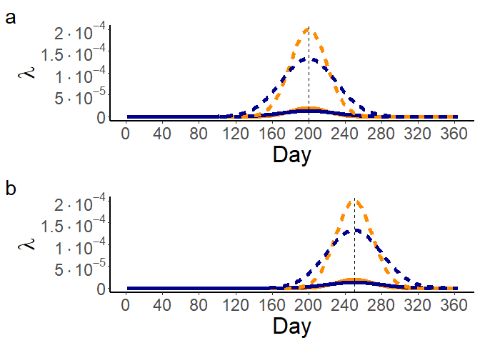

Epicurve short presentation
================
Giovanni Marini
22/08/2024

# Background

This is a presentation for the epiCurve set of functions, which can be
used to interpolate epidemiological curves assuming that the lying force
of infection (FOI, i.e. the rate at which susceptible individuals
acquire the infection) can be modelled through the density function of a
normal distribution. There are two main assumptions beneath our
analysis:

1.  The infection is implicitly modelled by a
    Susceptible-Infected-Susceptible (SIS) model with an external FOI.
    Humans are therefore dead-end hosts and do not actively impact on
    the pathogen circulation.

2.  The FOI has a seasonal pattern. This is the case of many
    vector-borne pathogens at temperate latitudes.

This modelling approach, introduced in Marini et al. (2022), can
therefore be used in the case of pathogens such as West Nile virus (WNV)
or tick-borne encephalitis (TBE). It allows to retrospectively evaluate
some key epidemiological parameters, namely when the FOI peaks, the
length of the epidemiological season and the magnitude.

# Modelling details

Let us assume we are considering some epidemiological data gathered
between $n$ years $Y_1, ..., Y_n$ in some regions. We denote by
$h_{y,i}(w)$ the number of recorded cases with region $i$ as place of
infection with symptoms onset occurred during week $w$ of year $y$
($w\in\{1, …, 52\}$, $y\in\{Y_1, ..., Y_n\}$), by $H_{y,i}$ the whole
time series, i.e. $H_{y,i}=(h_{y,i}(1), ..., h_{y,i}(52))$, and by
$\sum_{y,i}$ the total number of cases with place of infection
identified as i recorded during year y,
i.e. $\sum_{y,i}=h_{y,i}(1)+h_{y,i}(2)+...+h_{y,i}(52)$.

For the analysis, we assume $h_{y,i}(w)$ belongs to a Poisson
distribution with average $\sum_{t\in T_W} N_i \cdot \lambda_{y,i}(t)$,
where $\lambda_{y,i}(t)$ denotes the FOI in region $i$ and year $y$ at
day $t$, $T_W$ represents the set of days in week $w$ and $N_i$ is the
number of inhabitants of the region. The FOI is therefore
$$\lambda_{y,i} (t)=c_{y,i}\cdot\frac{1}{\sigma_{y,i}\sqrt{2\pi}}e^{-\frac{1}{2}\left( \frac{t-\mu_{y,i}}{\sigma_{y,i}}\right)^2}.$$
Where $\mu_{y,i}$ and $\sigma_{y,i}$ represent respectively the average
and standard deviation of the distribution and $c_{y,i}$ is a magnitude
rescaling factor, representing the overall intensity of infections in
that year and geographical area.

We can see some different realizations for the force of infection
$\lambda$ obtained with different parameter combinations.



The timing of the FOI peak depends on the average $\mu$, which indicates
the Julian day for which $\lambda$ reaches its maximum. for panel a
$\mu=200$ (July 19) while for panel b we set $\mu=250$ (September 7).

The curve width can depend on $\sigma$ (in orange $\sigma=20$, in blue
$\sigma=30$): a smaller value corresponds to a steeper curve, if the
other two parameters do not change. Thus, $\sigma$ provides an estimate
for the length (in days) of the epidemiological season.

Finally, parameter $c$ by definition rescales the whole curve, hence it
can be interpreted as a measure of the FOI magnitude. Dashed lines
(higher values) are obtained with $c=0.01$ while continuous lines with
$c=0.001$. It is thus clear that the total number of expected infections
depends directly on $c$, while $\mu$ and $\sigma$ can be regarded as
parameters concerning the timing of infections.

These three parameters will be estimated by matching the generated
epidemiological curve to the observed data through a maximum likelihood
approach.

For further additional details please see Marini et al. (2022) and
Marini et al. (2024).

# Loading data

First of all we load the `tidyverse` library, the functions needed to
carry out the analysis and our files. More specifically, we need two
files, one CSV with the case-based data and another one with the number
of inhabitants for each considered region.

``` r
library(tidyverse)
source("epiCurve_functions.R")
cases_df=read.csv("Data/disease_cases.csv")
population=read.csv("data/population.csv")
```

Let’s see how the two CSV files should be:

``` r
head(cases_df)
```

    ##   REGION ONSET_DATE
    ## 1      a 2010-07-06
    ## 2      a 2010-07-14
    ## 3      a 2010-07-15
    ## 4      a 2010-07-15
    ## 5      a 2010-07-16
    ## 6      a 2010-07-20

``` r
head(population)
```

    ##   REGION    POP
    ## 1      a 100374
    ## 2      b 100220
    ## 3      c 100066
    ## 4      d 100285
    ## 5      e  99693
    ## 6      f 100727

So each line of the epidemiological file represents a single case with
their region of infection (in this example denoted by a letter, but it
could be a municipality, a province, a country…) and the date of the
onset of the symptoms.

The population file consists of the number of inhabitants for each
region.

We can plot our data to see the total number of cases during the period
of interest.

``` r
cases_df$ONSET_DATE=as.Date(cases_df$ONSET_DATE)

my_theme=theme(panel.background = element_blank(),
               axis.title=element_text(size=20), axis.text=element_text(size=16))

hist_week=ggplot(data=cases_df)+
  geom_bar(aes(x=ONSET_DATE))+
  labs(x="Date of symptoms onset", y="Count")+
  my_theme

hist_week
```


So cases are recorded seasonally, which is one of the major requirements
for our modelling approach.

# Modelling

We are now going to fit each epidemiological curve $H_{y,i}$ , i.e. each
set of cases recorded during each year and each region. This is done
through the `epi_fit` function, after preparing the appropriate dataset
through the `create_dataset` function. In this latter function we
specify the name of the raw dataset and the minimum number of total
cases for each epidemiological curve to be considered (i.e., we will
model only those curves with $\sum_{y,i}\geq$`minimum_cases`). For our
example we set `minimum_cases=5`.

The variable `run_fit` specified whether we want to run the fit. If we
already did this part we can set it to `FALSE` as we already have the
output saved in the specified CSV file.

``` r
output_file_name="normal_FOI_fit.csv"
minimum_cases=5
matrix_weekly_cases=create_dataset(minimum_cases, cases_df)
```

    ## `summarise()` has grouped output by 'REGION'. You can override using the
    ## `.groups` argument.

``` r
run_fit=F
if(run_fit)
  epi_fit(matrix_weekly_cases,population,output_file_name)
```

We can now load the output file and see what it contains:

``` r
output_model=read.csv("normal_FOI_fit.csv",header=T)
head(output_model)
```

    ##   REGIONS YEAR POPULATION OBSERVED_TOTAL MODEL_TOTAL  MU    SD       C_NORM
    ## 1       a 2010     100374             34          33 230 23.69 0.0003376378
    ## 2       a 2011     100374             31          30 234 18.72 0.0003081435
    ## 3       a 2012     100374             32          37 219 23.28 0.0003808616
    ## 4       a 2013     100374             24          20 232 12.58 0.0002037438
    ## 5       a 2014     100374             39          39 240 18.03 0.0003935380
    ## 6       a 2015     100374             33          38 228 25.68 0.0004088476

So each line represents a particular epidemiological curve $H_{y,i}$ as
specified by the region and year (first two columns). The third column
indicates the number of inhabitants of the region, the fourth and the
fifth provide the observed ($\sum_{y,i}$) and modelled
($\bar{\sum_{y,i}}$) total number of cases respectively. Finally in the
last three columns the best likelihood estimated for the three FOI
parameters are given: $\mu$, $\sigma$ and $c$.

First of all we can check how well we fitted the curves, for instance
through a scatterplot and a correlation test:

``` r
cor.test(output_model$OBSERVED_TOTAL,output_model$MODEL_TOTAL)
```

    ## 
    ##  Pearson's product-moment correlation
    ## 
    ## data:  output_model$OBSERVED_TOTAL and output_model$MODEL_TOTAL
    ## t = 23.347, df = 138, p-value < 2.2e-16
    ## alternative hypothesis: true correlation is not equal to 0
    ## 95 percent confidence interval:
    ##  0.8539503 0.9224871
    ## sample estimates:
    ##       cor 
    ## 0.8932973

``` r
plot(output_model$OBSERVED_TOTAL,output_model$MODEL_TOTAL,
     xlab="Observed total cases",ylab="Modelled total cases",
     xlim=c(minimum_cases,max(c(output_model$OBSERVED_TOTAL,output_model$MODEL_TOTAL))),
     ylim=c(minimum_cases,max(c(output_model$OBSERVED_TOTAL,output_model$MODEL_TOTAL))))
abline(a=0,b=1)
```


So there is quite a good agreement between the two quantities. We can
also evaluate the average squared error as
`mean((output_model$OBSERVED_TOTAL-output_model$MODEL_TOTAL)^2)` which
in our case equals to 10.2.

We can also visually compare an observed curve with its fit. For
instance, let’s see region a during 2016.

``` r
selected_year=2016
selected_region="a"
selected_row=which(matrix_weekly_cases$REGION==selected_region & matrix_weekly_cases$YEAR==selected_year)

weekly_observed_cases=as.numeric(matrix_weekly_cases[selected_row,-c(1,2)])
N=as.numeric(output_model$POPULATION[selected_row])
weekly_model_cases=c()
for(week_start_index in seq(1,364,7)){
  c_FOI=output_model$C_NORM[selected_row]
  mu_FOI=output_model$MU[selected_row]
  sd_FOI=output_model$SD[selected_row]
  FOI_model=c_FOI*dnorm(1:364, mean = mu_FOI, sd = sd_FOI)
  
  tmp=0
  for(day in week_start_index:(week_start_index+6))
    tmp=tmp+N*FOI_model[day]
  weekly_model_cases=c(weekly_model_cases,tmp)
}

ymax=max(weekly_observed_cases,weekly_model_cases)

df_to_plot=data.frame(WEEK=1:length(weekly_observed_cases),
                      CASES=weekly_observed_cases,TYPE="OBS")
df_to_plot=rbind(df_to_plot,data.frame(WEEK=1:length(weekly_observed_cases),
                                       CASES=weekly_model_cases,TYPE="MODEL"))
ggplot(df_to_plot,aes(x=WEEK,y=CASES))+
  geom_line(aes(x=WEEK, y=CASES,col=TYPE),size=1)+
  geom_point(aes(x=WEEK, y=CASES,col=TYPE,shape=TYPE),size=3)+
  labs(x = "Week", y=expression("h"["y,i"]))+
  my_theme+
  theme(axis.line=element_line(linewidth=1))+
  scale_color_manual(values=c("orchid2","mediumpurple2"))
```


# References

<div id="refs" class="references csl-bib-body hanging-indent">

<div id="ref-Marini2024" class="csl-entry">

Marini, Giovanni, Mitra B. Drakulovic, Verica Jovanovic, Francesca
Dagostin, Willy Wint, Valentina Tagliapietra, Milena Vasic, and
Annapaola Rizzoli. 2024. “Drivers and Epidemiological Patterns of West
Nile Virus in Serbia.” *Frontiers in Public Health* 12 (July).
<https://doi.org/10.3389/fpubh.2024.1429583>.

</div>

<div id="ref-Marini2022" class="csl-entry">

Marini, Giovanni, Andrea Pugliese, William Wint, Neil S. Alexander,
Annapaola Rizzoli, and Roberto Rosà. 2022. “Modelling the West Nile
Virus Force of Infection in the European Human Population.” *One Health*
15: 100462.
https://doi.org/<https://doi.org/10.1016/j.onehlt.2022.100462>.

</div>

</div>
